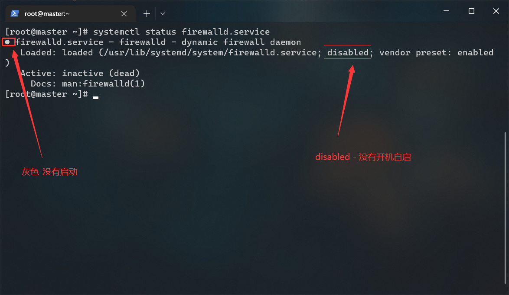
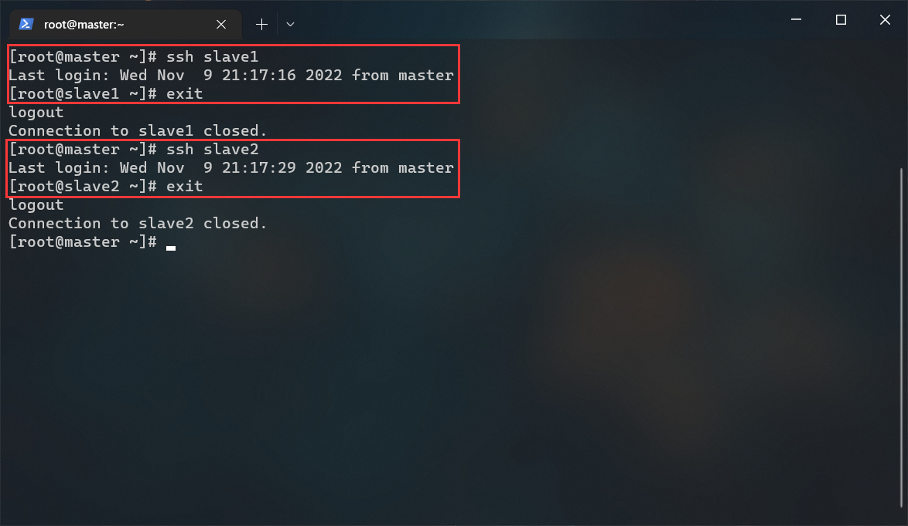
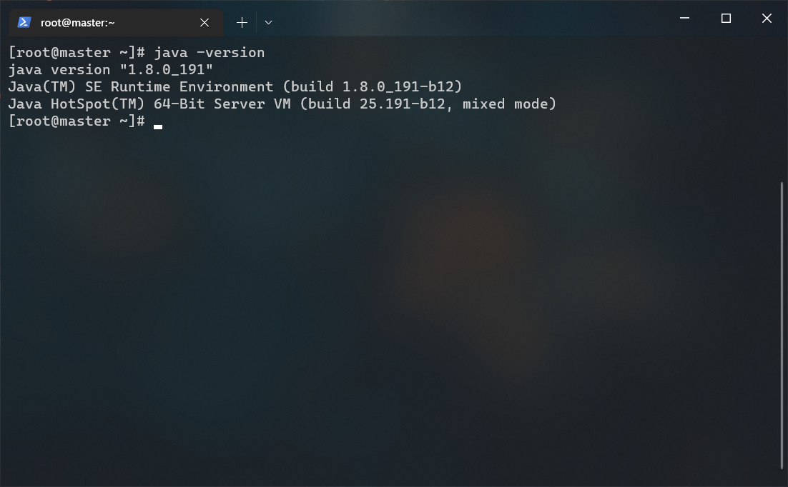
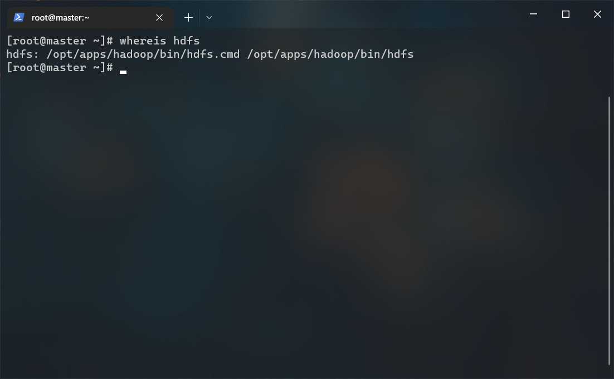
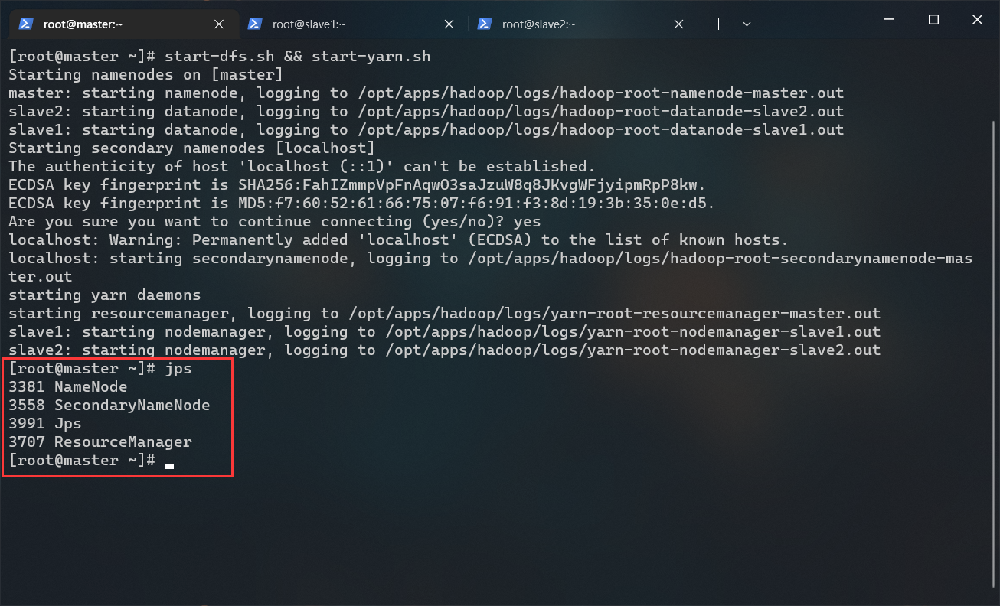
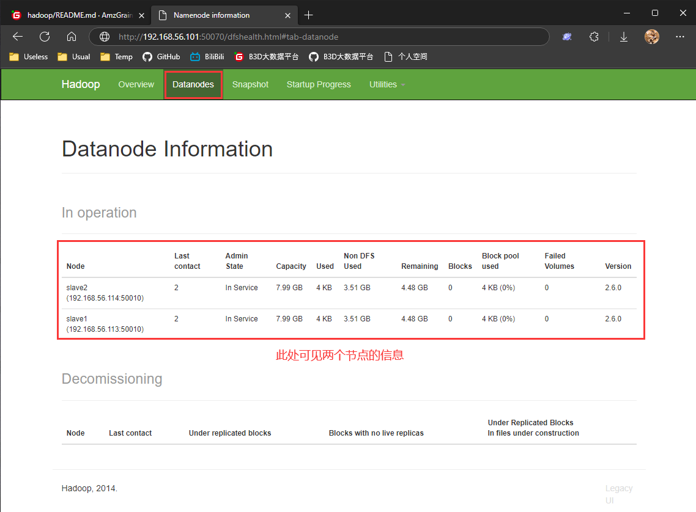
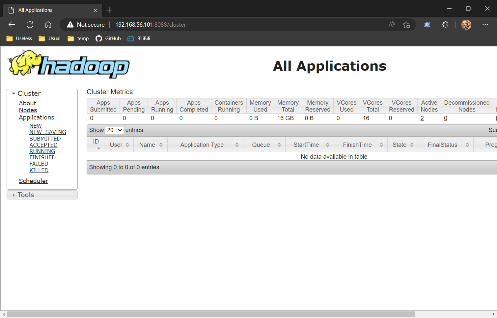

# HADOOP 搭建文档

## 1.前提条件
- CentOS-7-x86_64-Minimal-2009.iso
- jdk-8u191-linux-x64.tar.gz（位于 /opt/tar/）
- hadoop-2.6.0.tar.gz（位于 /opt/tar/）
- 三台互通的虚拟机

---

## 2.假设
第一台服务器的IP: 192.168.56.101  
第二台服务器的IP: 192.168.56.102   
第三台服务器的IP: 192.168.56.103

---

## 3.修改主机名
修改主机名主要是为了在集群中分辨主次  

在第一台服务器上操作：
``` shell
# 宿主
hostnamectl set-hostname master
```

在第二台服务器上操作：
``` shell
# 节点
hostnamectl set-hostname slave1
```

在第三台服务器上操作：

``` shell
# 节点
hostnamectl set-hostname slave2
```

执行以上操作，依次为每一台主机设置一个主机名。

---

## 4.修改 hosts 规则
> 以下内容均在 master 节点上操作  
> hosts 有什么作用请自行百度

通过 vi 修改 /etc/hosts 文件:
``` shell
# 编辑 hosts 文件
vi /etc/hosts
```

在尾部追加几条规则，修改后的内容如图所示：


---

## 5.同步 hosts 规则
> 以下内容均在 master 节点上操作

通过 scp 命令将 master 节点上已经修改过的 hosts 文件发送到 slave1 和 slave2：
``` shell
# scp 源 目标 (如果目标已存在则覆盖)
scp /etc/hosts slave1:/etc/hosts
scp /etc/hosts slave1:/etc/hosts
```

## 6.关闭防火墙
> 以下内容须在所有节点上操作操作一次

systemctl 用于控制服务，使用 systemctl 关闭防火墙：
``` shell
# systemctl 操作 服务

# 关闭防火墙
systemctl stop firewalld.service

# 禁止开机自启
systemctl disable firewalld.service
```

查看防火墙状态，确认上面执行的是否已经生效：
``` shell
systemctl status firewalld.service
```


---

## 7.配置 SSH 免密登录
> 以下内容均在 master 节点上操作

生成一个 RSA 密钥，一直回车即可。
``` shell
# ssh-keygen -t 密钥类型
ssh-keygen -t rsa
```


创建可信配置：
``` shell
# 给自己添加可信配置呢，此举方便后面启动集群。
ssh-copy-id master

# 节点1
ssh-copy-id slave1

# 节点2
ssh-copy-id slave2
```
测试是否配置成功免密登录


---

## 8.Hadoop 集群部署
> 以下内容均在 master 节点上操作
``` shell
# 切换到 opt 目录
cd /opt

# 新建 apps 目录并进入
mkdir apps && cd apps

# 解压 hadoop 和 jdk
tar -zxf /opt/tar/hadoop-2.6.0.tar.gz
tar -zxf /opt/tar/jdk-8u191-linux-x64.tar.gz

# 重命名 hadoop
mv ./hadoop-2.6.0 ./apps/hadoop

# 重命名 jdk
mv ./jdk1.8.0_191 ./apps/jdk
```

### 配置环境变量
编辑用户根目录下的 .bashrc 文件：
``` shell
vi ~/.bashrc
```

在末尾追加以下内容：
``` shell
export  HADOOP_HOME=/opt/apps/hadoop
export  PATH=$PATH:$HADOOP_HOME/bin:$HADOOP_HOME/sbin
export  JAVA_HOME=/opt/apps/jdk
export  PATH=$PATH:$JAVA_HOME/bin
```

刷新环境变量：
``` shell
source ~/.bashrc
```

测试 jdk 环境变量：
``` shell
java -version
```


测试 hadoop 环境变量：
``` shell
whereis hdfs
```


---

## 9.Hadoop 集群配置
进入到 hadoop 配置文件的目录下：
``` shell
cd /opt/apps/hadoop/etc/hadoop/
```

### 配置 hadoop-env.sh
使用 vi 编辑 hadoop-env.sh：
``` shell
vi hadoop-env.sh
```

在尾部追加以下内容:
``` shell
export HADOOP_IDENT_STRING=$USER
export JAVA_HOME=/opt/apps/jdk
```

### <span id="core-site-xml">配置 core-site.xml</span>
使用 vi 编辑 core-site.xml：
``` shell
vi core-site.xml
```

修改后长这样：
``` xml
<?xml version="1.0" encoding="UTF-8"?>
<?xml-stylesheet type="text/xsl" href="configuration.xsl"?>

<configuration>
  <property>
    <name>fs.defaultFS</name>
    <value>hdfs://master:9000</value>
  </property>
  <property>
    <name>hadoop.tmp.dir</name>
    <value>file:/opt/apps/hadoop/tmp</value>
  </property>
</configuration>
```

参数名|默认值|参数解释
-|-|-
fs.defaultFS|file://|文件系统主机和端口
io.file.bufffer.size|4096|流文件的缓冲区大小
hadoop.tmp.dir|/tmp/hadoop-${user_name}|临时目录

### 配置 hdfs-site.xml
使用 vi 编辑 core-site.xml：
``` shell
vi hdfs-site.xml
```

修改后长这样：
``` xml
<?xml version="1.0" encoding="UTF-8"?>
<?xml-stylesheet type="text/xsl" href="configuration.xsl"?>

<configuration>
  <property>
    <name>dfs.replication</name>
    <value>2</value>
  </property>
  <property>
    <name>dfs.namenode.name.dir</name>
    <value>file:/opt/apps/hadoop/tmp/dfs/name</value>
  </property>
  <property>
    <name>dfs.datanode.data.dir</name>
    <value>file:/opt/apps/hadoop/tmp/dfs/data</value>
  </property>
  <property>
    <name>dfs.secondary.http.address<name>
    <value>127.0.0.1:50090</value>
  </property>
</configuration>
```

参数名|默认值|参数解释
-|-|-
dfs.replication|3|缺省的块复制数量
dfs.webhdfs.enabled|true|是否通过http协议读取hdfs文件（不安全）
dfs.namenode.name.dir|file://${hadoop.tmp.dir}/dfs/name|dfs名称节点存储位置
dfs.datanode.data.dir|file://${hadoop.tmp.dir}/dfs/data|dfs数据节点存储数据块的位置
dfs.secondary.http.address|0.0.0.0:50090|hdfs对应的http服务器地址

### 配置 mapred-queues.xml
使用模板配置：
``` shell
cp ./mapred-site.xml.template ./mapred-site.xml
vi mapred-site.xml
```

修改后长这样：
``` xml
<?xml version="1.0"?>
<?xml-stylesheet type="text/xsl" href="configuration.xsl"?>

<configuration>
  <property>
    <name>mapreduce.framework.name<name>
    <value>yarn</value>
  </property>
</configuration>
```

参数名|默认值|参数解释
-|-|-
mapreduce.framework.name|local|取 local \| classic \| yarn 其中之一，若非 yarn 则不会使用 yarn 集群来实现资源的分配。
mapreduce.jobhistory.address|0.0.0.0:10020|定义历史服务器的地址和端口，通过历史服务器查看已经运行完的 Mapreduce 作业记录。
mapreduce.jobhistory.webapp.address|0.0.0.0:19888|定义历史服务器 web 应用访问地址和端口。

### 配置 yarn-site.xml
使用 vi 编辑 yarn-site.xml：
``` shell
vi yarn-site.xml
```

修改后长这样：
``` xml
<?xml version="1.0"?>

<configuration>
  <property>
    <name>yarn.resourcemanagerhostname</name>
    <value>master</value>
  </property>
  <property>
    <name>yarn.nodemanageraux-services</name>
    <value>mapreduce_shuffle</value>
  </property>
</configuration>
```

参数名|默认值|参数解释
-|-|-
yarn.resourcemanager.address|0.0.0.0:8032|ResourceManager提供给客户端访问的地址. 客户端通过该地址向RM提交应用程序，杀死应用程序等
yarn.resourcemanager.scheduler.address|0.0.0.0:8030|定义历史服务器的地址和端口，通过历史服务器查看已经运行完的 Mapreduce 作业记录
yarn.resourcemanager.resource-tracker.address|0.0.0.0:8031|ResourceManager 提供给 NodeManager 的地址. NodeManager 通过该地址向 RM 汇报心跳，领取任务等
yarn.resourcemanager.admin.address|0.0.0.0:8033|ResourceManager提供给管理员的访问地址. 管理员通过该地址向 RM 发送管理命令等
yarn.resourcemanager.webapp.address|0.0.0.0:8088|ResourceManager对 web 服务提供地址. 用户可通过该地址在浏览器中查看集群各类信息
yarn.nodemanager.aux-services|org.apache.hadoop.mapred.ShuffleHandler|通过该配置项，用户可以自定义一些服务，例如 Map-Reduce 的shuffle 功能就是采用这种方式实现的，这样就可以在 NodeManager 上扩展自己的服务

### 配置 slaves
使用 vi 编辑 slaves：
``` shell
vi slaves
```

slaves 文件内部需要填写所有节点，修改后长这样：
```
slave1
slave2
```

---

## 10.从主节点分发文件
> 以下内容均在 master 节点上操作

下发 apps 目录到 slave1 和 slave2 节点：
``` shell
scp -r /opt/apps slave1:/opt/
scp -r /opt/apps slave2:/opt/
```

下发环境变量配置文件到 slave1 和 slave2 节点：
``` shell
scp ~/.bashrc slave1:~/.bashrc
scp ~/.bashrc slave2:~/.bashrc
```

在所有节点上执行这个命令：
``` shell
source ~/.bashrc
```

## 11.启动 Hadoop 集群
> 以下内容均在 master 节点上操作

格式化元数据：（切记，千万不要多次执行此命令）
``` shell
hdfs namenode -format
```

> 如果多次执行了此命令，可以清空前面在 [core-site.xml](#core-site-xml) 里配置的缓存目录解决异常或警告：
>``` shell
> rm -rf /opt/apps/hadoop/tmp/*
> ```
> 然后再次执行依次格式化即可：
> ``` shell
> hdfs namenode -format
> ```

正常输出：


启动 hdfs 和 yarn：
``` shell
start-dfs.sh && start-yarn.sh
```


---

## 12.检查启动情况
检查 hadoop ：
``` shell
jps
```


> 我们已经在前面建立了 master 的 hosts 规则  
> 但是我们的实体机没有建立 hosts 规则，所以并不认识 master
> 只需要把 master 替换成对应的 IP 地址即可
> master -> 192.168.56.101

检查端口启动状态的方法有很多种，这里我们使用最简单的浏览器测试法。

浏览器打开 http://192.168.56.101:50070 ：


浏览器打开 http://192.168.56.101:8088 ：


浏览器打开 http://192.168.56.101:9000 ：


以上代表正常工作。


## 13.测试 Hadoop
关闭安全模式：
``` shell
hdfs dfsadmin -safemode leave
```

来一波计算测试：
``` shell
# 切换目录
cd /opt/apps/hadoop/share/hadoop/mapreduce/

# 来一波 mapreduce 计算测试
hadoop jar hadoop-mapreduce-examples-2.6.0.jar pi 10 10

# 计算很漫长，鄙人的2核2G虚拟机跑了630秒。
# 最终计算结果是 Estimated value of Pi is 3.20000000000000000000
```

查看 hdfs 报告：
``` shell
hdfs dfsadmin -report
```