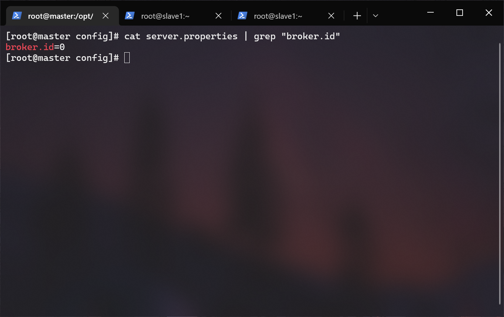
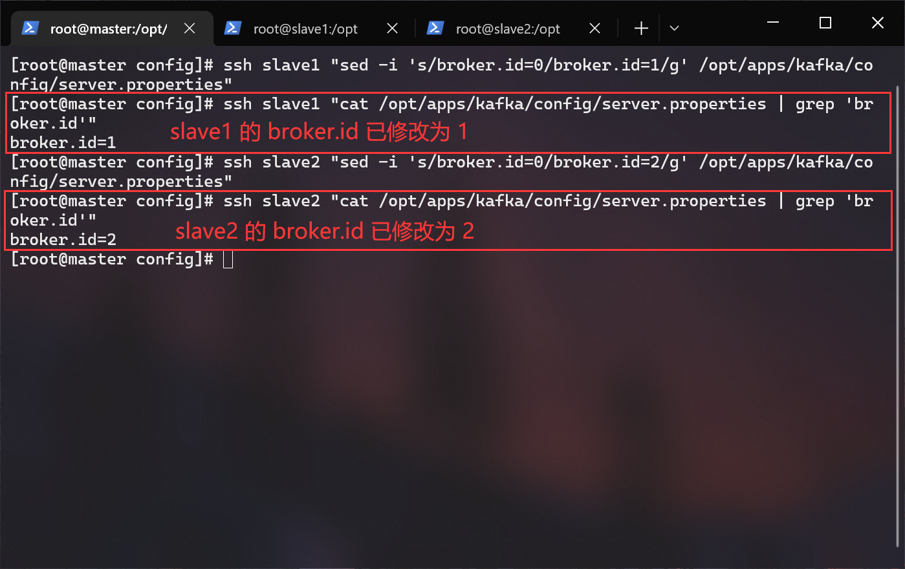
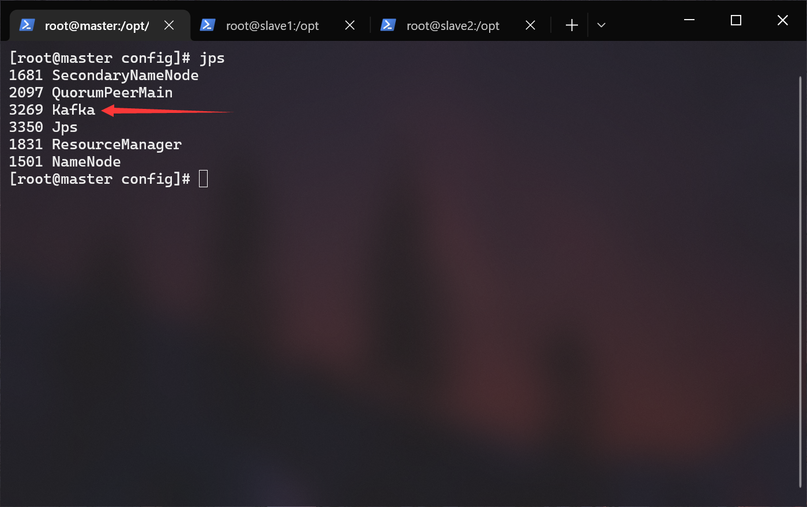
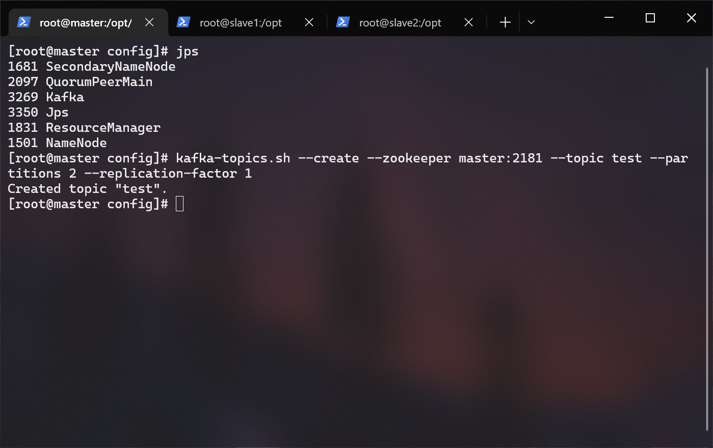
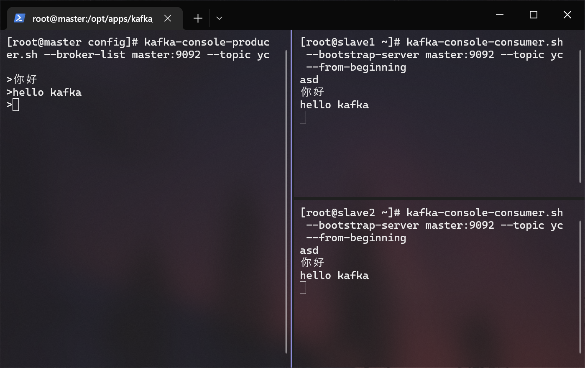

# <span id="top">Kafka 搭建文档</span>

## 前提条件
- hadoop 集群已经启动
- zookeeper 已经启动
- kafka_2.11-1.0.0.tgz（位于/opt/tar下）
- 分布式搭建

---

## 介绍
是由 Linkedin 公司开发的。它是一个分布式的、支持多分区、多副本、基于 Zookeeper 的分布式消息流平台，它同时也是一款开源的基于发布订阅模式的消息引擎系统。KAFKA 因为根据自身需要，并未严格遵循 MQ（Message Queue） 规范，而是基于 TCP\IP 自行封装了一套协议，通过网络 socket 接口进行传输，实现了 MQ（Message Queue） 的功能。

### Broker
消息服务器，作为 Server 提供消息核心服务。

### Producer
消息生产者，业务的发起方，负责生产消息传输给 Broker。

### Consumer
消息消费者，业务的处理方，负责从 Broker 获取消息并进行业务逻辑处理。

### Topic
主题，发布订阅模式下的消息统一汇集地，不同生产者向 Topic 发送消息，由 MQ 服务器分发到不同的订阅者，实现消息的广播。

### Queue
队列。PTP 模式下，特定生产者向特定 Queue 发送消息，消费者订阅特定的 Queue 完成指定消息的接收。

### Message
消息体，根据不同通信协议定义的固定格式进行编码的数据包，来封装业务数据，实现消息的传输。

### 发布-订阅消息传递
KAFKA 工作在此模式下，发布者发送到 Topic 的消息，只有订阅了 Topic 的订阅者才会收到消息。

---

## 1.解压
> 以下内容在 master 节点上操作

进入 /opt/app/ 目录内：
``` shell
cd /opt/apps
```

解压 apache-flume-1.6.0-bin.tar.gz 到当前目录：
``` shell
tar -zxf /opt/tar/kafka_2.11-1.0.0.tgz
```

重命名 kafka ：
``` shelll
mv ./kafka_2.11-1.0.0 ./kafka
```

---

## 2.配置环境变量
> 以下内容在 master 节点上操作

编辑用户根目录下的 .bashrc 文件：
``` shell
vi ~/.bashrc
```

在文件末尾添加：
``` shell
export KAFKA_HOME=/opt/apps/kafka
export PATH=$PATH:$KAFKA_HOME/bin
```

## 3.生效环境变量
> 以下内容在 master 节点上操作
``` shell
source ~/.bashrc
```

---

## 4.修改配置文件
> 以下内容在 master 节点上操作

进入配置文件目录：
``` shell
cd /opt/apps/kafka/config
```

创建 kafka 的日志目录：
``` shell
mkdir /opt/apps/kafka/logs
```

使用 vi 编辑 server.properties：
``` shell
vi server.properties
```

找到并修改以下内容:
``` shell
# 日志目录（确保这个目录存在）
log.dirs=/opt/apps/kafka/logs

# 节点
zookeeper.connect=master:2181,slave1:2181,slave2:2181
```

---

## 5.分发文件
> 以下内容在 master 节点上操作

下发 kafka 目录到 slave1 和 slave2 节点：
``` shell
scp -r /opt/apps/kafka slave1:/opt/apps/
scp -r /opt/apps/kafka slave2:/opt/apps/
```

下发环境变量文件到 slave1 和 slave2 节点：
``` shell
scp ~/.bashrc slave1:~/.bashrc
scp ~/.bashrc slave2:~/.bashrc
```
---

## 6.生效环境变量：
> 以下内容在 master 节点上操作
``` shell
# 生效本机的环境变量
source ~/.bashrc

# 生效 slave1 的环境变量
ssh slave1 "source ~/.bashrc"

# 生效 slave2 的环境变量
ssh slave2 "source ~/.bashrc"
```

---

## 7.设置 Broker ID
通过 cat 组合 grep 看一下 server.properties 文件内 broker.id 的默认值是什么：
``` shell
cat server.properties | grep "broker.id"
```


那我们就规划以下三个节点的 Broker ID：
- master -> 0（无需修改了）
- slave1 -> 1
- slave2 -> 2

将 slave1 的 broker.id 修改为 1：
``` shell
ssh slave1 "sed -i 's/broker.id=0/broker.id=1/g' /opt/apps/kafka/config/server.properties"
```

将 slave2 的 broker.id 修改为 2：
``` shell
ssh slave2 "sed -i 's/broker.id=0/broker.id=2/g' /opt/apps/kafka/config/server.properties"
```


---

## 8.启动 Kafka
启动 Kafka（后面跟上 & 是为了使它后台运行）：
``` shell
kafka-server-start.sh -daemon /opt/apps/kafka/config/server.properties &
```

通过 jps 可以看到 Kafka：


---

## 9.测试
新建一个名为 test 的 Topic ：
``` shell
kafka-topics.sh --create --zookeeper master:2181 --partitions 2 --replication-factor 1 --topic test
```


查看 Topic :
``` shell
kafka-topics.sh --list --zookeeper master:2181
```


发送消息：
> 在 master 节点上执行
``` shell
# 生产者发送消息
kafka-console-producer.sh --broker-list master:9092 --topic test
```

接收消息：
> 在 master 以外的任意节点上执行：
``` shell
# --from-beginning 同步历史消息
kafka-console-consumer.sh --bootstrap-server master:9092 --topic test --from-beginning
```

在生产者终端输入一些内容按下回车，就会发现消费者终端已经接收到了来自生产者的消息（其中 asd 消息是之前发送过的历史消息，因为我们加了 --from-beginning 参数，所以也被同步回来了）：


---

## 10.其他
解释：
- Topic：消息名称
- Partition：分区号（从 0 开始）
- Leader：所在分区的 broker 编号，负责处理消息的读写。（从所有节点中随机选择）
- Replicas：列出了所有的副本节点，不管节点是否在服务中。
- Isr：正在服务中的节点。

查看某个 Topic（例如 test）：
``` shell
kafka-topics.sh --zookeeper master:2181 --describe –topic test
```

删除某个 Topic（例如 test）：
``` shell
kafka-topics.sh --delete --zookeeper master:2181 --topic test
```

---

## 快速跳转
[回到顶部](#top)  
<!-- [FLINK ON YARN 部署文档](../flink_on_yarn/README.md) -->
完结撒花