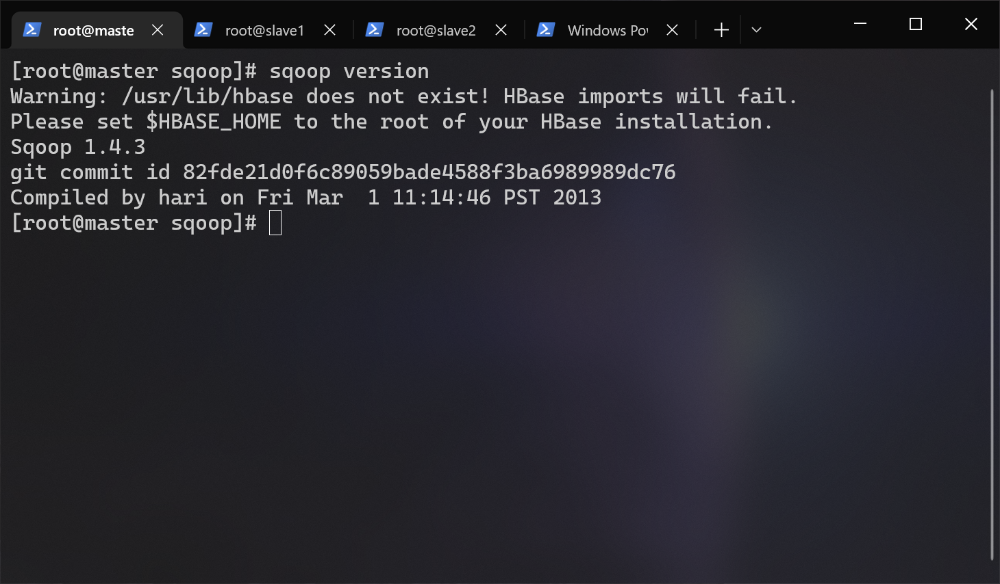
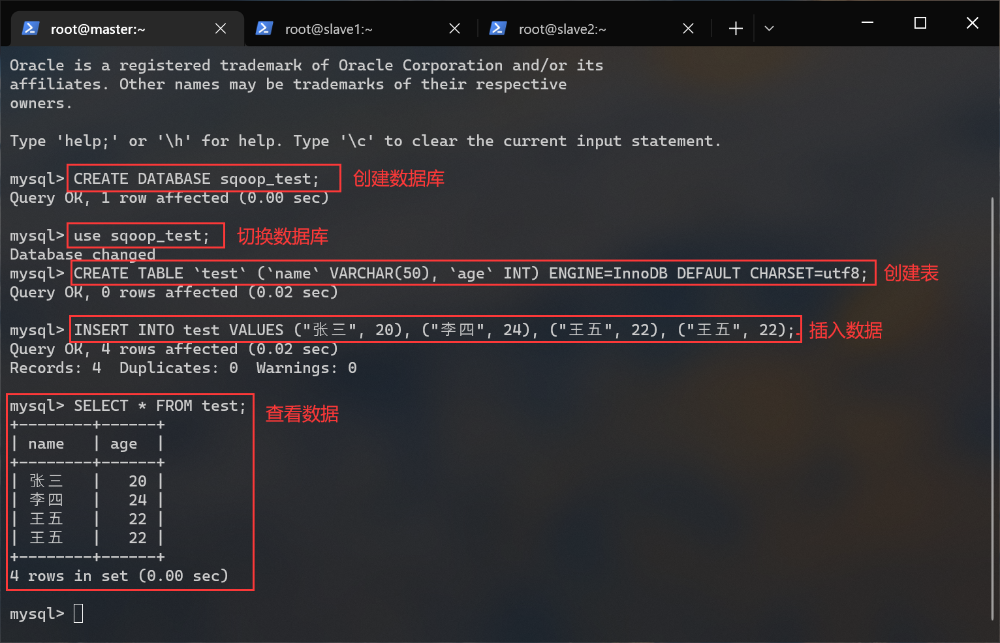
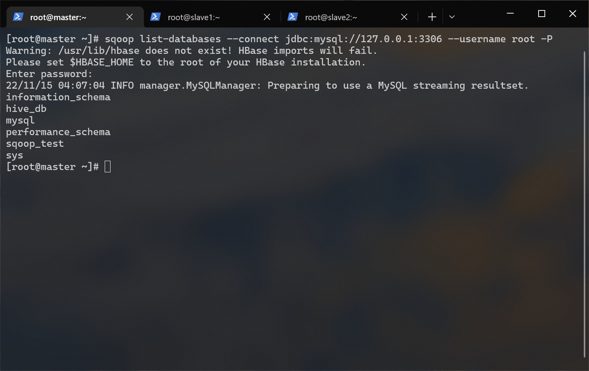
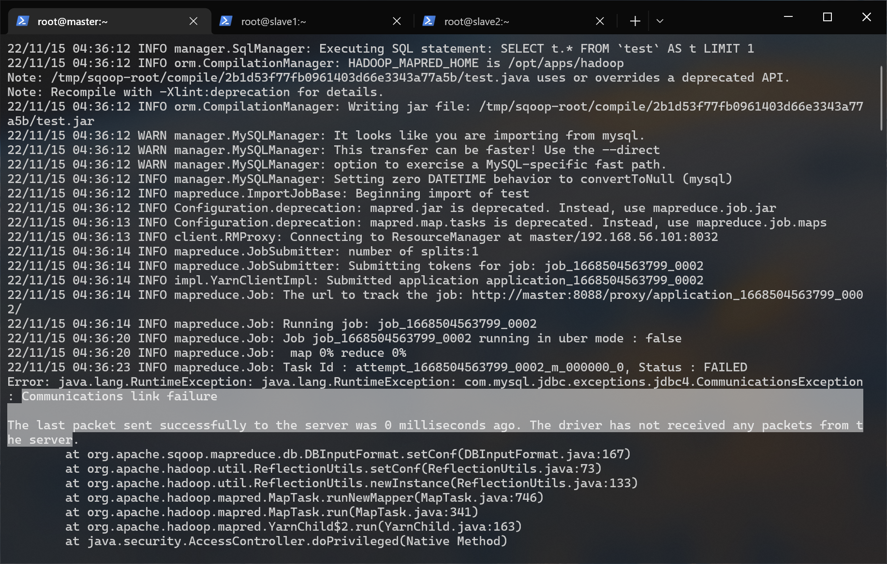
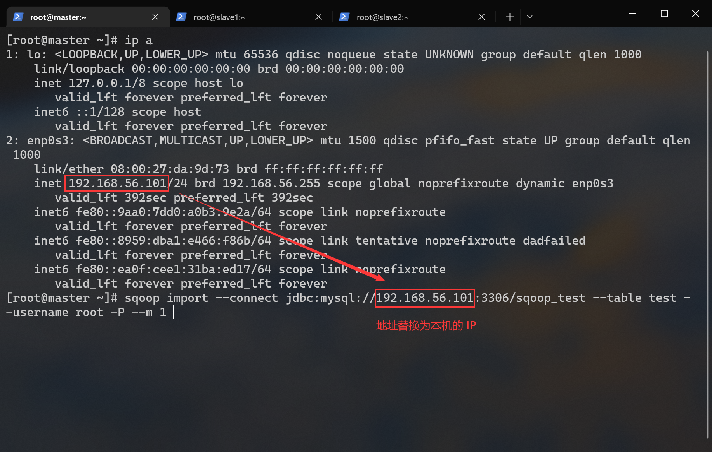
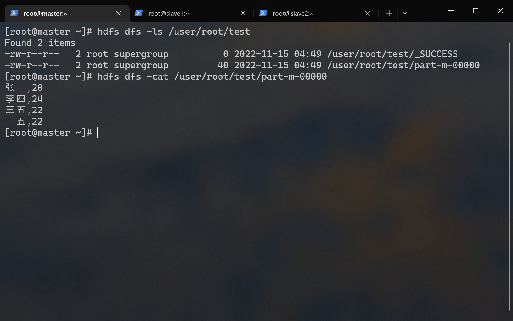
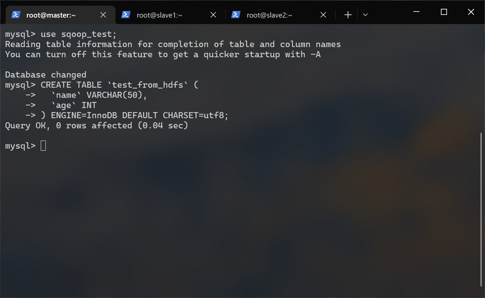
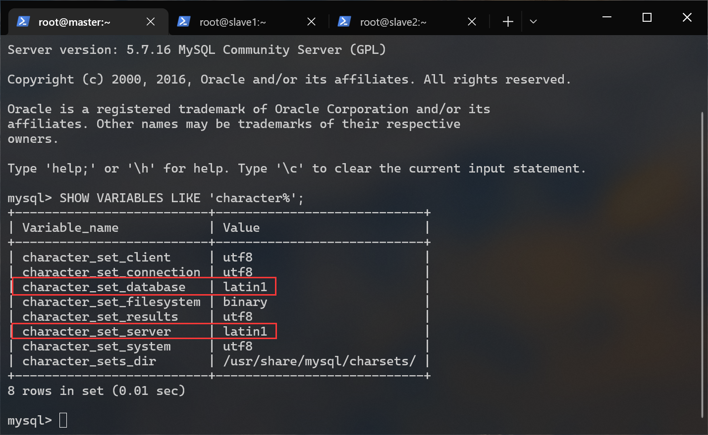

# <span id="top">SQOOP 搭建文档</span>

## 前提条件
- hadoop 集群已经启动
- mysql 已部署完毕
- hive 已部署完毕
- mysql-connector-java-5.1.32.jar（位于/opt/tar下）
- sqoop-1.4.3.bin__hadoop-2.0.0-alpha.tar.gz（位于/opt/tar下）

---

## 1.解压
进入 /opt/app/ 目录内：
``` shell
cd /opt/apps
```

解压 sqoop-1.4.3.bin__hadoop-2.0.0-alpha.tar.gz 到当前目录：
``` shell
tar -zxf /opt/tar/sqoop-1.4.3.bin__hadoop-2.0.0-alpha.tar.gz
```

重命名 sqoop ：
``` shelll
mv ./sqoop-1.4.3.bin__hadoop-2.0.0-alpha ./sqoop
```

---

## 2.放入 MySQL 驱动包：
因为我们要通过 sqoop 操作 mysql，所以需要将java 连接 mysql 需要用到的驱动复制到 sqoop/lib 下：
``` shell
cp /opt/tar/mysql-connector-java-5.1.32.jar /opt/apps/sqoop/lib/
```

---

## 3.配置环境变量
编辑用户根目录下的 .bashrc 文件：
``` shell
vi ~/.bashrc
```

在文件末尾添加：
``` shell
export SQOOP_HOME=/opt/apps/sqoop
export PATH=$PATH:$SQOOP_HOME/bin
```

生效环境变量：
``` shell
source ~/.bashrc
```

---

## 4.验证安装
执行这条指令：
``` shell
sqoop version
```


---

## 5.使用sqoop 前的准备工作
修改 mysql 的配置文件：
``` shell
vi /etc/my.cnf
```

在 my.cnf 配置文件中，bind-address 如果是 127.0.0.1，则 mysql 只接受本地连接，不接受远程连接。在 bind-address 后面增加远程访问 IP 地址或者注释掉这句话就可以远程登陆了。所以我们需要注释掉这一行（没有的话就无需这一步操作）：
``` shell
# 注释以井号开头
bind-address = 127.0.0.1
```

以 root 身份登录到 mysql ：
``` shell
mysql -u root -p
```

依照我们之前在[ mysql 搭建文档 ](../mysql/README.md)说过的方法，完全允许 root 远程连接 mysql ：  
命令解释：
  - GRANT：赋权命令
  - ALL PRIVILEGES：当前用户的所有权限
  - ON：介词
  - \*.\*：当前用户对所有数据库和表的操作权限
  - TO：介词
  - 'root'@'%'：权限赋给 root 用户，所有 ip 都能连接
  - WITH GRANT OPTION：允许级联赋权
``` sql
/*
  在开发环境建议这么做，在生产环境上是很危险的操作。
*/
GRANT ALL PRIVILEGES ON *.* TO 'root'@'%' WITH GRANT OPTION;
```

刷新权限：
``` sql
FLUSH PRIVILEGES;
```

创建一个用于测试 sqoop 的数据库和表：
``` sql
# 创建 sqoop_test 数据库
CREATE DATABASE sqoop_test;

# 切换到 sqoop_test 数据库
use sqoop_test;

# 创建 test 表
CREATE TABLE `test` (`name` VARCHAR(50), `age` INT) ENGINE=InnoDB DEFAULT CHARSET=utf8;
```


---

插入一些数据：
``` sql
INSERT INTO test VALUES ("张三", 20), ("李四", 24), ("王五", 22), ("王五", 22);
```


---

## 6.sqoop 指令菜单
查看 sqoop 指令帮助：
``` shell
sqoop help
```


命令|解释
-|-
import|导入数据到集群
export|从集群导出数据
codegen|生成与数据库记录交互的代码
create-hive-table|创建 hive 表
eval|查看 sql 执行结果
import-all-tables|导出某个数据库内的所有表到 hdfs
job|生成一个 job
list-databases|列出所有数据库名称
list-tables|列出某个数据库内的所有表
merge|将 hdfs 中不同目录下的数据合在一起，并存放在指定的目录中
metastore|记录 Sqoop job 的元数据信息，如果不启动 Metastore 实例，则默认的元数据存储日录为 ~/.sqoop
help|打印 sqoop 帮助信息
version|打印 sqoop 版本信息

---

## 7.测试 sqoop 连接 mysql

使用 sqoop 打印 mysql 内所有数据库名：
> 通过 `sqoop help list-databases` 命令打印帮助信息。
``` shell
sqoop list-databases --connect jdbc:mysql://localhost:3306 --username root -P
```


使用 sqoop 打印 sqoop_test 内所有数据表名：
> 通过 `sqoop help list-tables` 命令打印帮助信息。
``` shell
sqoop list-tables --connect jdbc:mysql://localhost:3306/sqoop_test --username root -P
```


---

## 8.导入 mysql 数据表到 hdfs
> 通过 `sqoop help import` 命令打印帮助信息。
``` shell
sqoop import --connect jdbc:mysql://localhost:3306/sqoop_test --table test --username root -P --m 1
```
如果遇到这个错误： 

不要慌，虽然任务执行结果显示的是失败，但实际上**已经成功导入数据表到 hdfs 了**。出现这个问题的原因是 mysql wait_timeout 参数时长设置过短或 mysql 地址出问题了。

有两个解决方法：
- 在 mysql 上修改 wait_timeout 时长
- 将 url 中localhost 修改为当前这台节点的内网 ip（非 127.0.0.1）。 

我们采用后面的方法。
删除之前导入的数据表：
``` shell
hdfs dfs -rm -r /user/root/test
```

再次导入：
``` shell
# master 节点的内网 IP 是 192.168.56.101
sqoop import --connect jdbc:mysql://192.168.56.101:3306/sqoop_test --table test --username root -P --m 1
```


超详细的终端输出信息：（选择性查看）
```
[root@master ~]# hdfs dfs -rm -r /user/root/test
22/11/15 04:49:30 INFO fs.TrashPolicyDefault: Namenode trash configuration: Deletion interval = 0 minutes, Emptier interval = 0 minutes.
Deleted /user/root/test
[root@master ~]# ip a
1: lo: <LOOPBACK,UP,LOWER_UP> mtu 65536 qdisc noqueue state UNKNOWN group default qlen 1000
    link/loopback 00:00:00:00:00:00 brd 00:00:00:00:00:00
    inet 127.0.0.1/8 scope host lo
       valid_lft forever preferred_lft forever
    inet6 ::1/128 scope host
       valid_lft forever preferred_lft forever
2: enp0s3: <BROADCAST,MULTICAST,UP,LOWER_UP> mtu 1500 qdisc pfifo_fast state UP group default qlen 1000
    link/ether 08:00:27:da:9d:73 brd ff:ff:ff:ff:ff:ff
    inet 192.168.56.101/24 brd 192.168.56.255 scope global noprefixroute dynamic enp0s3
       valid_lft 557sec preferred_lft 557sec
    inet6 fe80::9aa0:7dd0:a0b3:9e2a/64 scope link noprefixroute
       valid_lft forever preferred_lft forever
    inet6 fe80::8959:dba1:e466:f86b/64 scope link tentative noprefixroute dadfailed
       valid_lft forever preferred_lft forever
    inet6 fe80::ea0f:cee1:31ba:ed17/64 scope link noprefixroute
       valid_lft forever preferred_lft forever
[root@master ~]# sqoop import --connect jdbc:mysql://192.168.56.101:3306/sqoop_test --table test --username root -P --m 1
Warning: /usr/lib/hbase does not exist! HBase imports will fail.
Please set $HBASE_HOME to the root of your HBase installation.
Enter password:
22/11/15 04:49:42 INFO manager.MySQLManager: Preparing to use a MySQL streaming resultset.
22/11/15 04:49:42 INFO tool.CodeGenTool: Beginning code generation
22/11/15 04:49:42 INFO manager.SqlManager: Executing SQL statement: SELECT t.* FROM `test` AS t LIMIT 1
22/11/15 04:49:42 INFO manager.SqlManager: Executing SQL statement: SELECT t.* FROM `test` AS t LIMIT 1
22/11/15 04:49:42 INFO orm.CompilationManager: HADOOP_MAPRED_HOME is /opt/apps/hadoop
Note: /tmp/sqoop-root/compile/99b67d991132af624d961b23f0d7934e/test.java uses or overrides a deprecated API.
Note: Recompile with -Xlint:deprecation for details.
22/11/15 04:49:43 INFO orm.CompilationManager: Writing jar file: /tmp/sqoop-root/compile/99b67d991132af624d961b23f0d7934e/test.jar
22/11/15 04:49:43 WARN manager.MySQLManager: It looks like you are importing from mysql.
22/11/15 04:49:43 WARN manager.MySQLManager: This transfer can be faster! Use the --direct
22/11/15 04:49:43 WARN manager.MySQLManager: option to exercise a MySQL-specific fast path.
22/11/15 04:49:43 INFO manager.MySQLManager: Setting zero DATETIME behavior to convertToNull (mysql)
22/11/15 04:49:43 INFO mapreduce.ImportJobBase: Beginning import of test
22/11/15 04:49:43 INFO Configuration.deprecation: mapred.jar is deprecated. Instead, use mapreduce.job.jar
22/11/15 04:49:43 INFO Configuration.deprecation: mapred.map.tasks is deprecated. Instead, use mapreduce.job.maps
22/11/15 04:49:43 INFO client.RMProxy: Connecting to ResourceManager at master/192.168.56.101:8032
22/11/15 04:49:45 INFO mapreduce.JobSubmitter: number of splits:1
22/11/15 04:49:45 INFO mapreduce.JobSubmitter: Submitting tokens for job: job_1668504563799_0005
22/11/15 04:49:45 INFO impl.YarnClientImpl: Submitted application application_1668504563799_0005
22/11/15 04:49:45 INFO mapreduce.Job: The url to track the job: http://master:8088/proxy/application_1668504563799_0005/
22/11/15 04:49:45 INFO mapreduce.Job: Running job: job_1668504563799_0005
22/11/15 04:49:49 INFO mapreduce.Job: Job job_1668504563799_0005 running in uber mode : false
22/11/15 04:49:49 INFO mapreduce.Job:  map 0% reduce 0%
22/11/15 04:49:53 INFO mapreduce.Job:  map 100% reduce 0%
22/11/15 04:49:53 INFO mapreduce.Job: Job job_1668504563799_0005 completed successfully
22/11/15 04:49:53 INFO mapreduce.Job: Counters: 30
        File System Counters
                FILE: Number of bytes read=0
                FILE: Number of bytes written=113471
                FILE: Number of read operations=0
                FILE: Number of large read operations=0
                FILE: Number of write operations=0
                HDFS: Number of bytes read=87
                HDFS: Number of bytes written=40
                HDFS: Number of read operations=4
                HDFS: Number of large read operations=0
                HDFS: Number of write operations=2
        Job Counters
                Launched map tasks=1
                Other local map tasks=1
                Total time spent by all maps in occupied slots (ms)=1796
                Total time spent by all reduces in occupied slots (ms)=0
                Total time spent by all map tasks (ms)=1796
                Total vcore-seconds taken by all map tasks=1796
                Total megabyte-seconds taken by all map tasks=1839104
        Map-Reduce Framework
                Map input records=4
                Map output records=4
                Input split bytes=87
                Spilled Records=0
                Failed Shuffles=0
                Merged Map outputs=0
                GC time elapsed (ms)=48
                CPU time spent (ms)=480
                Physical memory (bytes) snapshot=158457856
                Virtual memory (bytes) snapshot=2096713728
                Total committed heap usage (bytes)=81788928
        File Input Format Counters
                Bytes Read=0
        File Output Format Counters
                Bytes Written=40
22/11/15 04:49:53 INFO mapreduce.ImportJobBase: Transferred 40 bytes in 9.9949 seconds (4.002 bytes/sec)
22/11/15 04:49:53 INFO mapreduce.ImportJobBase: Retrieved 4 records.
[root@master ~]#
```

查看导入结果：
``` shell
hdfs dfs -cat /user/root/test/part-m-00000
```



---

## 9.导入 hdfs 数据表到 mysql
进入 mysql 创建一个表：
``` sql
CREATE TABLE `test_from_hdfs` (
  `name` VARCHAR(50),
  `age` INT
) ENGINE=InnoDB DEFAULT CHARSET=utf8;
```


导入数据：
``` shell
sqoop export --connect jdbc:mysql://192.168.56.101:3306/sqoop_test --username root -P --table test_from_hdfs --m 1 --export-dir /user/root/test --input-fields-terminated-by ","
```


超详细的终端输出信息：（选择性查看）
```
[root@master apps]# sqoop export --connect jdbc:mysql://192.168.56.101:3306/sqoop_test --table test_from_hdfs --m 1 --export-dir /user/root/test --input-fields-terminated-by "," --username root -P                                                                             Warning: /usr/lib/hbase does not exist! HBase imports will fail.
Please set $HBASE_HOME to the root of your HBase installation.
Enter password:
22/11/15 08:05:50 INFO manager.MySQLManager: Preparing to use a MySQL streaming resultset.
22/11/15 08:05:50 INFO tool.CodeGenTool: Beginning code generation
22/11/15 08:05:50 INFO manager.SqlManager: Executing SQL statement: SELECT t.* FROM `test_from_hdfs` AS t LIMIT 1
22/11/15 08:05:50 INFO manager.SqlManager: Executing SQL statement: SELECT t.* FROM `test_from_hdfs` AS t LIMIT 1
22/11/15 08:05:50 INFO orm.CompilationManager: HADOOP_MAPRED_HOME is /opt/apps/hadoop
Note: /tmp/sqoop-root/compile/317eb183b19ebf387845c80e913a3a2a/test_from_hdfs.java uses or overrides a deprecated API.
Note: Recompile with -Xlint:deprecation for details.
22/11/15 08:05:51 INFO orm.CompilationManager: Writing jar file: /tmp/sqoop-root/compile/317eb183b19ebf387845c80e913a3a2a/test_from_hdfs.jar
22/11/15 08:05:51 INFO mapreduce.ExportJobBase: Beginning export of test_from_hdfs
22/11/15 08:05:51 INFO Configuration.deprecation: mapred.jar is deprecated. Instead, use mapreduce.job.jar
22/11/15 08:05:51 INFO Configuration.deprecation: mapred.reduce.tasks.speculative.execution is deprecated. Instead, use mapreduce.reduce.speculative
22/11/15 08:05:51 INFO Configuration.deprecation: mapred.map.tasks.speculative.execution is deprecated. Instead, use mapreduce.map.speculative
22/11/15 08:05:51 INFO Configuration.deprecation: mapred.map.tasks is deprecated. Instead, use mapreduce.job.maps
22/11/15 08:05:51 INFO client.RMProxy: Connecting to ResourceManager at master/192.168.56.101:8032
22/11/15 08:05:53 INFO input.FileInputFormat: Total input paths to process : 1
22/11/15 08:05:53 INFO input.FileInputFormat: Total input paths to process : 1
22/11/15 08:05:53 INFO mapreduce.JobSubmitter: number of splits:1
22/11/15 08:05:53 INFO mapreduce.JobSubmitter: Submitting tokens for job: job_1668514459196_0002
22/11/15 08:05:53 INFO impl.YarnClientImpl: Submitted application application_1668514459196_0002
22/11/15 08:05:53 INFO mapreduce.Job: The url to track the job: http://master:8088/proxy/application_1668514459196_0002/
22/11/15 08:05:53 INFO mapreduce.Job: Running job: job_1668514459196_0002
22/11/15 08:05:57 INFO mapreduce.Job: Job job_1668514459196_0002 running in uber mode : false
22/11/15 08:05:57 INFO mapreduce.Job:  map 0% reduce 0%
22/11/15 08:06:01 INFO mapreduce.Job:  map 100% reduce 0%
22/11/15 08:06:02 INFO mapreduce.Job: Job job_1668514459196_0002 completed successfully
22/11/15 08:06:02 INFO mapreduce.Job: Counters: 30
        File System Counters
                FILE: Number of bytes read=0
                FILE: Number of bytes written=113330
                FILE: Number of read operations=0
                FILE: Number of large read operations=0
                FILE: Number of write operations=0
                HDFS: Number of bytes read=152
                HDFS: Number of bytes written=0
                HDFS: Number of read operations=4
                HDFS: Number of large read operations=0
                HDFS: Number of write operations=0
        Job Counters
                Launched map tasks=1
                Data-local map tasks=1
                Total time spent by all maps in occupied slots (ms)=2100
                Total time spent by all reduces in occupied slots (ms)=0
                Total time spent by all map tasks (ms)=2100
                Total vcore-seconds taken by all map tasks=2100
                Total megabyte-seconds taken by all map tasks=2150400
        Map-Reduce Framework
                Map input records=4
                Map output records=4
                Input split bytes=109
                Spilled Records=0
                Failed Shuffles=0
                Merged Map outputs=0
                GC time elapsed (ms)=67
                CPU time spent (ms)=440
                Physical memory (bytes) snapshot=167534592
                Virtual memory (bytes) snapshot=2097709056
                Total committed heap usage (bytes)=84934656
        File Input Format Counters
                Bytes Read=0
        File Output Format Counters
                Bytes Written=0
22/11/15 08:06:02 INFO mapreduce.ExportJobBase: Transferred 152 bytes in 10.8975 seconds (13.9481 bytes/sec)
22/11/15 08:06:02 INFO mapreduce.ExportJobBase: Exported 4 records.
[root@master apps]#
```

来查看下我们前面创建的 test_from_hdfs 表：

可以看到数据导入成功了，但是有一个新的问题。那就是所有的汉字都显示成了问号，篇幅原因我们放在下一节一一道来。

---

## 10.解决从 hdfs 导入到 mysql 中的数据中，中文变问号的问题
进入 mysql ：
``` shell
mysql -u root -p
```

查看编码信息：
``` sql
SHOW VARIABLES LIKE 'character%'; 
```

可以看到有些地方的编码是 latin1，这种编码并不能显示中文。

编辑 my.cnf ：
``` shell
vi /etc/my.cnf
```

添加这两行到末尾：
```
character-set-server=utf8
init_connect='SET NAMES utf8'
```

修改后的 my.cnf ：
``` diff
# For advice on how to change settings please see
# http://dev.mysql.com/doc/refman/5.7/en/server-configuration-defaults.html

[mysqld]
#
# Remove leading # and set to the amount of RAM for the most important data
# cache in MySQL. Start at 70% of total RAM for dedicated server, else 10%.
# innodb_buffer_pool_size = 128M
#
# Remove leading # to turn on a very important data integrity option: logging
# changes to the binary log between backups.
# log_bin
#
# Remove leading # to set options mainly useful for reporting servers.
# The server defaults are faster for transactions and fast SELECTs.
# Adjust sizes as needed, experiment to find the optimal values.
# join_buffer_size = 128M
# sort_buffer_size = 2M
# read_rnd_buffer_size = 2M
datadir=/var/lib/mysql
socket=/var/lib/mysql/mysql.sock
# Disabling symbolic-links is recommended to prevent assorted security risks
symbolic-links=0

log-error=/var/log/mysqld.log
pid-file=/var/run/mysqld/mysqld.pid
+ character-set-server=utf8
+ init_connect='SET NAMES utf8'
```

重启 mysql 服务：
``` shell
systemctl restart mysqld.service
```

---

## 快速跳转
[回到顶部](#top)  
[HBASE 部署文档](../kafaka/README.md)